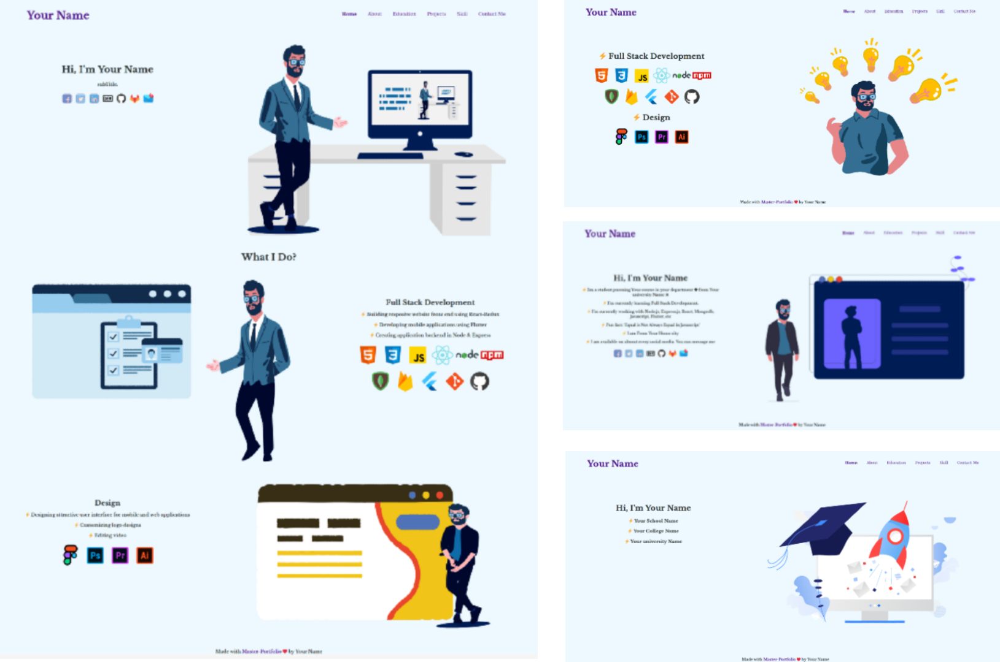

[](https://github.com/vimal-verma/Master-Portfolio)

[](https://app.netlify.com/sites/vima/deploys)
[](https://github.com/vimal-verma/Master-Portfolio/network/members)
[](https://github.com/vimalverma558/Master-Portfolio/stargazers)
[](https://github.com/vimalverma558/Master-Portfolio/blob/master/LICENSE)


[](https://github.com/vimalverma558/Master-Portfolio/issues)
[](https://vima.netlify.app/)


[](https://repl.it/github/vimalverma558/Master-Portfolio)

[](https://gitpod.io/#https://github.com/vimal-verma/Master-Portfolio)
[](https://vima.netlify.app/)
[](https://dev.letskhabar.com/post/master-portfolio)


# Master-Portfolio
- A clean, beautiful, responsive and 100% customizable portfolio template for Developers!
- It can List your all Projects & Certificate
- it can Also list your All Dev.to articles Using Api (if you have set `BlogData.show_Blog: true` in `src/Name.js`)
- The website is completely built on `react-js` framework of `javascript`🔥.
- In this project, there are basically Personal Information that you need to change to customize this to anyone else's portfolio
- You will find `src/Name.js` file which contains the complete information about the user. The file looks something like below
- 
    ``` 
    const greeting = {
        title: "Hi, I'm Your Name",
        logo_name: "Name",
        logo_img_show: false, // if true than show image(logo) in home page instant of text(logo)
        logo_img: "https://master-portfolio.js.org/src/assets/img/mplogo.png",
        full_name: "your name",
        email: "email id",
        subTitle:
        "I'm a student pursuing {Course} in {department} from {university}. I'm a passionate learner who's always willing to learn and work across technologies and domains. I love to explore new technologies and leverage. Apart from that I also love to guide and mentor newbies. I'm currently into Web Development and working on my MERN Website",
        Programming: true,  // if true, Show 'Programming' section in home page, if false than not show
        developer: true,  // if true, Show 'Full Stack Development' section in home page, if false than not show
        designer: true,  // if true, Show 'designer' section in home page, if false than not show
        cloud_infra_architecture:true,  // if true, Show 'cloud_infra_architecture' section in home page, if false than not show
        data_Science: true,  // if true, Show 'data_Science' section in home page, if false than not show
        ml_ai: true,  // if true, Show 'ml_ai' section in home page, if false than not show
        Robotic: true,  // if true, Show 'Robotic' section in home page, if false than not show
        gamedev: true,  // if true, Show 'gamedev' section in home page, if false than not show
    };
    const BlogData = {
        // this show your dev.to blog in your Portfolio blog
        show_Blog: true,  // if true it Show your DEV.to article in Blog Section, if false than Blog Section(nav) convert to skill Section(nav).
        devto_username: "vimal"
    };
    const socialMedia = {
        facebook: "Your facebook link",
        twitter: "Your twitter link",
        instagram: "Your instagram link",
        github: "Your github link",
        gitlab: "Your gitlab link",
        devto: "Your devto link",
        mailto: "mailto:Your mail"
    };
    const about = {
        School: "Your School Name",
        College: "Your College Name",
        university: "Your university Name",
        Home: "Your Home city"
    };
    const projects = [
    {
        id: "1",
        name: "project 1",
        Description: "this is Description",
        Code_Link: "this is code link",
        Live_link: "this is Live link",
        tool_used: "html,css,js", 
        img: "https://master-portfolio.js.org/src/assets/img/mplogo.png"
    },
    .........
    ]
    ```
[](https://vima.netlify.app/)
[](https://vima.netlify.app/)
[](https://dev.letskhabar.com/post/master-portfolio)


# You can Customize it to make your own portfolio by Three Method ✏️
- [Using Template](#using-template)
- [Using Netfify deploy](#using-netlify-deploy)
- [Using Vercel deploy](#using-vercel-deploy)


## Using Template
- Click on Use this template ☝️
- clone `git clone https://github.com/{your github username}/{repository name}`
- To download required dependencies to your system, navigate to the directory where the cloned repository resides and execute following command: `npm install`
- change "homepage " to `https://{your github username}.github.io/{repository name}` in `package.json` 
- Edit `src/Name.js` 
- You can check it using `npm start`, it will open the website locally on your browser.
- Commit change and push.
- Once you are done with your setup and have successfully completed all steps above, 
- ### Now you have to deploy that portfolio website
  - You can use Netlify, Vercel & gh-pages
  - To deploy by gh-pages
    - Run `npm run deploy` to build and create a branch called `gh-pages`. It will push the build files to that branch.
    -  🎉 Your Portfolio website is ready.🥳 And live at `https://{your github username}.github.io/{repository name}`.


## Using Netlify deploy
[](https://app.netlify.com/start/deploy?repository=https://github.com/vimalverma558/Master-Portfolio)
- Click on Deploy button ☝️
- <details>
  <summary>Click on connect to Github</summary>
  
  </details>
- <details>
  <summary>Click on Authorize netlify</summary>
  
  </details>
- <details>
  <summary>Chose a github repository name and click on Save and Deploy</summary>
  
  </details>
- <details>
  <summary>Your portfolio website is live 🚀</summary>
  
  </details> 
- Those step ☝️ create a repository in your github account, go to that repository
- Edit `src/Name.js` 
- Commit change and push 🎉 Your Portfolio website is ready.🥳


## Using Vercel deploy
[](https://vercel.com/new/git/external?repository-url=https%3A%2F%2Fgithub.com%vimal-verma%2FMaster-Portfolio)
- Click on Deploy button ☝️
- <details>
  <summary>Type a Project name and click on continue</summary>
  
  </details>
- <details>
  <summary>Install Vercel for Github(If not already) </summary>
  
  </details>
- <details>
  <summary>Chose a github repository name and click on continue</summary>
  
  </details>
- <details>
  <summary>Verify Framework preset is Create React App and Click on Deploy</summary>
  
  </details> 
- <details>
  <summary>Your portfolio website is live 🚀</summary>
  
  </details> 
- Those step ☝️ create a repository in your github account, go to that repository
- Edit `src/Name.js` 
- Commit change and push 🎉 Your Portfolio website is ready.🥳


## Contributing
Please see our [contributing.md](./CONTRIBUTING.md).


## Awesome contributors ✨

<a href="https://github.com/vimal-verma/Master-Portfolio/graphs/contributors">
  
</a>


## References 👏🏻
- Master-Portfolio logo Design by [Vimal](https://github.com/vimal-verma).
- Art Customized by [Vimal](https://github.com/vimal-verma) and icon by icon8
- contributors image Made with [contributors-img](https://contributors-img.web.app).
- MIT License 
